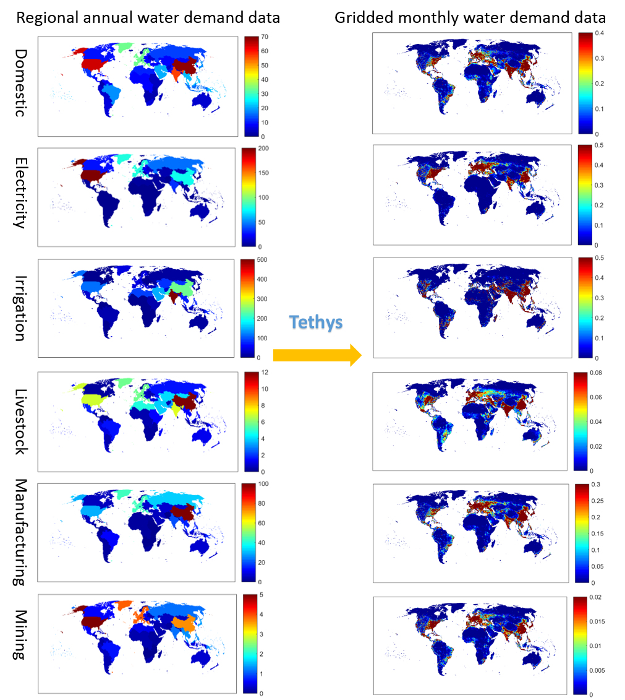

Getting Started
==================================

About
-----------------------------------
Tethys is a spatiotemporal downscaling model for global water use constructed at the Joint Global Change Research Institute of the Pacific Northwest National Laboratory (http://www.globalchange.umd.edu). It serves to link several hydrological models to the Global Change Analysis Model (GCAM) by disaggregating geopolitical region and water basin scale data from GCAM into finer spatial and temporal resolutions.

GCAM uses 32 geopolitical regions for energy and economy systems, and 235 water basins for land, agriculture, and water systems, with 5 year timesteps. Hydrological and other sectoral models often need gridded data with 0.5 or 0.125 geographic degree resolution and monthly timesteps in order to model physical processes heavily influenced by surface and subsurface features. Tethys applies statistical downscaling algorithms to reconstruct water withdrawal data at this resolution across six sectors: irrigation, livestock, domestic, electricity generation, manufacturing, and mining. The methodology and equations used are described in more detail in :ref:`downscaling-algorithms`.

  
  *Major inputs and outputs of Tethys by six sectors*

Prerequisites
-----------------------------------
* Python (tested on 3.9) https://www.python.org/downloads/ 
* Java https://www.java.com/en/download/

.. note:: Without Java installed, the dependency gcamreader will be unable to query the GCAM database files.

Installation
-----------------------------------
Currently, tethys can be cloned from https://github.com/JGCRI/tethys using::

    $ git clone https://github.com/JGCRI/tethys

To switch to the active development branch, use::

	$ git checkout dev

Once downloaded, install as a Python package by running "setup.py" from the command line::

	$ python setup.py install
	
This will automatically install the packages listed in :ref:`dependencies`. In order to avoid package version conflicts, consider creating a virtual environment for tethys.

In the future, easy installation will be available via pip.

.. _installing-package-data:

Installing Package Data
-----------------------------------
Example data is available for download at https://zenodo.org/record/4780604#.YXGH8Z7MJPY. 

.. note:: Although the download is 2.1 GB, the extracted data will require around **9.6 GB** of storage space.

Once extracted, change the paths in "config.ini" to point to the relevant files and directories on your machine.

Run
-----------------------------------
Verify the installation was successful by running the following in Python::

	from tethys.model import Tethys
	
Make sure the config file is properly set up and somewhere Python can find it (or use its absolute file path), then run::

   dmw = Tethys('config.ini')
   
Logging info should begin printing to the console, and after a few minutes downscaled data and diagnostics output files will be created.

.. _dependencies:

Dependencies
------------

===========	================
Dependency	Minimum Version
===========	================
configobj	5.0.6
numpy		1.20.3
pandas		1.2.4
scipy		1.6.3
requests	2.20.0
gcamreader	1.2.5
===========	================

Optional Dependencies
---------------------

=======================	================
Dependency      		Minimum Version
=======================	================
build					0.5.1
nbsphinx				0.8.6
setuptools				57.0.0
sphinx					4.0.2
sphinx-panels			0.6.0
sphinx-rtd-theme		0.5.2
sphinx-mathjax-offline	0.0.1
twine					3.4.1
=======================	================