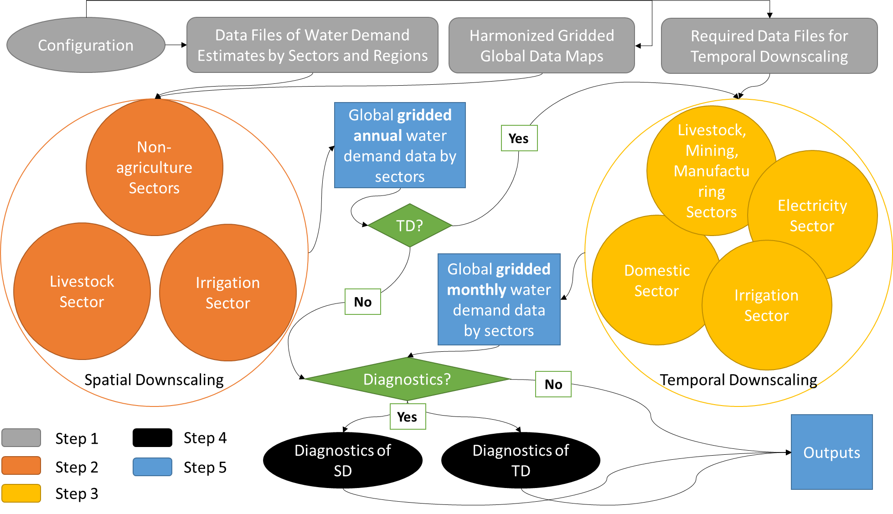

User Guide
==========

Architecture
------------

Below is a conceptual overview of tethys. The downscaling process can be thought of in 2 main stages: First, the GCAM data is downscaled spatially, from 32 geopolitical regions and 235 basins to a 0.5 geographic degree grid. Then, that data is further downscaled temporally, from every 5 years to monthly. During both of these stages, water withdrawal data is downscaled separately within six sectors (irrigation, livestock, domestic, electricity generation, manufacturing, and mining), using data from various :ref:`input-files` and several :ref:`downscaling-algorithms`.

  
  *Flowchart of Tethys*

The resulting :ref:`output-files` are written to a folder, which can be specified by the user in the :ref:`configuration-file`. The config file also has options to make tethys perform diagnostics on the output, or even skip the temporal downscaling step, should that be desired.

.. _input-files:

Input files
-----------

This section contains descriptions of the example input files from :ref:`installing-package-data`, and some additional reference files included with tethys. Should you wish to run tethys with alternate input data, you'll need to prepare those files using this same structure.

.. note:: Adapted from https://github.com/JGCRI/tethys/blob/main/docs/ReadMe_IO_Data.pdf, may need to be further modified to reflect recent changes.

Example/Input
^^^^^^^^^^^^^
The following files are located at the top level of the example input folder. They provide information about the regions, basins, countries, and grid coordinates.

BasinNames.csv
""""""""""""""
235 basin names corresponding to harmonized_inputs/basin.csv

* **File Format:** csv, no header 
* **Dimension:** 235 row * 1 column 
* **Unit:** N/A 
* **Reference:** N/A 

coordinates.csv
"""""""""""""""
Coordinates of the 67420 grid cells

* **File Format:** csv, no header
* **Dimension:** 67420 rows x 5 columns (ID #, longitude, latitude, ilon, ilat)
* **Unit:** N/A
* **Reference:** N/A
 
country-names.csv
"""""""""""""""""
249 country names corresponding to harmonized_inputs/country.csv

* **File Format:** csv, no header 
* **Dimension:** 235 row * 2 column, first column is ID (integer, 0-248), second column is country name (string) 
* **Unit:** N/A 
* **Reference:** N/A

gcam_basin_lookup.csv
"""""""""""""""""""""
235 gcam basin lookup names corresponding to basin id and name

* **File Format:** csv, no header 
* **Dimension:** 235 row * 3 columns, first column is ID (integer, 1-235), second column is basin name (string), third column is gcam lookup name
* **Unit:** N/A 
* **Reference:** N/A

Grid_Areas_ID.csv
"""""""""""""""""
Area value of each land grid cell

* **File Format:** csv, no header
* **Dimension:** 67420 rows x 1 column column, decimal values 
* **Unit:** ha (convert to km2 by *0.01)
* **Reference:** N/A

GCAM
^^^^
The GCAM folder is where the regional water withdrawal data to be downscaled comes from. It actually contains full GCAM output databases (which have a lot of data other than water withdrawal, hence their size). These databases are queried for the relevant water withdrawal data across the six sectors (at the scale of 32 regions, every 5 years), which gets fed into tethys.

The example data contains 2 different output databases from GCAM: *gcam5p1_ref_db* and *ssp1_rcp26_gfdl*. There are are also 2 xml query files, *query_regaez.xml* and *query_regbasin.xml* corresponding to different versions of GCAM (regions and AEZ or regions and basins). The choice of database and query is indicated by the user in the config file.

The specifics of GCAM outputs and queries are outside the scope of this documentation. For more information, refer to RELEVANT_LINK.

rgn32
^^^^^
The *rgn32* folder contains additional information about these regions, such as region names, and various region-specific conversion ratios (eg, GCAM models the aggregate sheep+goat count in each region, but separate sheep and goat populations can be reconstructed from a "sheep to goat" ratio).

RgnNames.csv
""""""""""""
The region names (e.g. "USA") and its corresponding id (e.g. 1 for USA).

* **File Format:** csv, one-row header
* **Dimension:** 32 rows x 2 columns, first column for region name (string), second column for region id (integer, 1-32)
* **Unit:** N/A
* **Reference:** N/A

bfracFAO2005.csv and gfracFAO2005.csv
"""""""""""""""""""""""""""""""""""""
Livestock in GCAM has five sectors (beef, dairy, pork, poultry and sheepgoat), to be reorganized into six sectors used by Tethys (buffalo, cattle, goat, sheep, pig and poultry), two fraction numbers are needed. One is recorded in bfracFAO2005.csv, the other is recorded in gfracFAO2005.csv:

	* buffalo	= (beef + diary)*bfrac 
	* cattle	= (beef + diary)*(1-bfrac) 
	* goat		= sheepgoat*gfrac 
	* sheep		= sheepgoat*(1-gfrac)
	

* **File Format:** csv, one-row header
* **Dimension:** 32 rows x 2 columns, first column for region name (string), second column for buffalo (bfrac) or goat (gfrac) fraction (decimal, < 1) in this region
* **Unit:** N/A
* **Reference:** estimated from FAO gridded livestock of the world (refer to "harmonized inputs/livestock_*.csv")

irrigation-frac.csv
"""""""""""""""""""
Pre-calculated irrigation shares as a fixed input, is used when extracting data files from GCAM database, if GCAM didn’t produce endogenous irrigated and rain-fed land allocations.

* **File Format:** csv, one-row header
* **Dimension:** 26 columns: region #, aez #, crop #, 1990, 2005, 2010, ..., 2100, region name, crop name, decimal values (0-1) for column 4-24
* **Unit:** N/A
* **Reference:** N/A

TD_Elec_paras
"""""""""""""
Five tables are included in this folder:

================================	========
ElecBuilding_1971_2010.csv			P\ :sub:`b`
ElecBuildingHeat_1971_2010.csv		P\ :sub:`h`
ElecBuildingCool_1971_2010.csv		P\ :sub:`c`
ElecBuildingOthers_1971_2010.csv	P\ :sub:`u`
ElecIndustry_1971_2010.csv			P\ :sub:`it`
================================	========

P\ :sub:`b` and P\ :sub:`it` are the proportions of total electricity use for building and transportation and industry together, respectively, P\ :sub:`b` + P\ :sub:`it` = 1.

P\ :sub:`h`, P\ :sub:`c` and P\ :sub:`u` are the proportions of total building electricity use for heating, cooling and other home utilities, respectively, P\ :sub:`h` + P\ :sub:`c` + P\ :sub:`u` = 1.

The proportions of electricity use, are used in temporal downscaling of electricity sector

* **File Format:** csv, no header
* **Dimension:** 32 rows x 40 columns (32 regions x 40 years), decimal values (0-1)
* **Unit:** N/A
* **Reference:** N/A

harmonized_inputs
^^^^^^^^^^^^^^^^^
The term "grid" is used to describe the spatial resolution of 0.5 geographic degrees. A global full data map contains a total of 259,200 grid cells (360 x 720) of which 67,420 grid cells are categorized as "land grids" and are considered valid for simulation purposes. In this study, the land grid cells are used to define a "gridded" map according to the coordinates and the indexes of the 67,420 cells on the 360 x 720 grid. The inputs converted using the 67,420 grid cells according to the coordinate data file are called harmonized inputs.

AEZ.csv
"""""""
AEZ ID for each cell, 18 zones: 1-18

* **File Format:** csv, one-row header
* **Dimension:** 67,420 rows x 1 column column
* **Unit:** N/A
* **Reference:** N/A

basin.csv
"""""""""
Basin ID for each cell, 235 basins: 1-235

* **File Format:** csv, one-row header
* **Dimension:** 67,420 rows x 1 column column
* **Unit:** N/A
* **Reference:** N/A

country.csv
"""""""""""
Country ID for each cell, 249 countries: 1-249

* **File Format:** csv, one-row header
* **Dimension:** 67,420 rows x 1 column column
* **Unit:** N/A
* **Reference:** N/A

GMIA_cropland.csv
"""""""""""""""""
Irrigation areas in 2005 in each grid cell

* **File Format:** csv, one-row header
* **Dimension:** 67,420 rows x 1 column column
* **Unit:** km\ :sup:`2`
* **Reference:** Siebert, 2013

HYDE_cropland.csv
"""""""""""""""""
Irrigation area in 1900-2000 in each grid cell: every 10 years

* **File Format:** csv, one-row header
* **Dimension:** 67,420 rows x 1 column1 columns (11 years)
* **Unit:** km\ :sup:`2`
* **Reference:** HYDE 3.1 Final, Klein Goldewijk et al., 2011

HYDE_grassland.csv
""""""""""""""""""
Irrigation areas in 1900-2000 in each grid cell: every 10 years

* **File Format:** csv, one-row header
* **Dimension:** 67,420 rows x 1 column1 columns (11 years)
* **Unit:** km\ :sup:`2`
* **Reference:** HYDE 3.1 Final, Klein Goldewijk et al., 2011

GPW_population.csv
""""""""""""""""""
Population: 1990-2015 data, every 5 years

* **File Format:** csv, one-row header
* **Dimension:** 67,420 rows x 6 columns (6 years)
* **Unit:** N/A
* **Reference:** CIESIN, 2016

HYDE_population.csv
"""""""""""""""""""
Population: 1750-2000 data, every 10 years

* **File Format:** csv, one-row header
* **Dimension:** 67,420 rows x 26 columns (26 years)
* **Unit:** N/A
* **Reference:** HYDE 3.1 Final, Klein Goldewijk et al., 2011

livestock_(animal).csv
""""""""""""""""""""""
6 files, containing the number of (buffalo/cattle/goat/pig/poultry/sheep) in each grid cell

* **File Format:** csv, one-row header
* **Dimension:** 67,420 rows x 1 column
* **Unit:** head
* **Reference:** Wint and Robinson, 2007.

soil_moisture.csv
""""""""""""""""""""
Population: Maximum Soil Moisture

* **File Format:** csv, one-row header
* **Dimension:** 67,420 rows x 1 column
* **Unit:** mm/month
* **Reference:** FAO, 2003.

region32_grids.csv
""""""""""""""""""""
Region ID for each cell, 32 regions: 1-32

* **File Format:** csv, one-row header
* **Dimension:** 67,420 rows x 1 column
* **Unit:** N/A
* **Reference:** N/A

TemporalDownscaling
^^^^^^^^^^^^^^^^^^^
The following files and folders are used during the temporal downscaling step.

DomesticR.csv
"""""""""""""
The amplitude (dimensionless) which measures the relative difference of domestic water withdraw between the warmest and coldest months. It is used in the temporal downscaling of domestic sector.

* **File Format:** csv, one-row header
* **Dimension:** 67420 rows x 1 column, decimal values
* **Unit:** N/A
* **Reference:** calibrated by Huang et al., 2017

Irrigation
""""""""""
The monthly gridded irrigation water withdrawal was estimated by relying on monthly irrigation results from other global hydrological models to quantify monthly weighting profiles of how irrigation is spread out within a year in a particular region and per crop type.

In this folder, three global gridded monthly irrigation water withdrawal models are provided as references for the period of 1971-2010:

* H08 (Hanasaki et al., 2008a; 2008b)

	* h08_wfdei_hist_varsoc_pirrww_global_monthly_1971_2010.nc
* LPJmL (Rost et al., 2008)

	* lpjml_wfdei_hist_varsoc_co2_pirrww_global_monthly_1971_2010.nc
* PCR-GLOBWB (Van Beek et al., 2011; Wada et al., 2011)

	* pcrglobwb_wfdei_varsoc_pirrww_global_monthly_1971_2010.nc

The original data files were obtained from ISI-MIP (Warszawski et al., 2014). We processed 
the original data files into gridded monthly percentage values as the weighting profiles 
applied in temporal downscaling of irrigation.

The data files are classic NetCDF file. They follow the same format:

* **Size**:       67420 x 480 
* **Dimensions**:  index, month 
* **Datatype**:   single 
* **Variables**: 'pirrww'

For more information about these three models and their data files, please refer to Huang 
et al., 2017.

.. note:: note to self: Seems to have been replaced by 1 file, watch_wfdei_monthly_1971_2010.npz

ClimateForcing/WATCH
""""""""""""""""""""
For temporal downscaling of electricity and domestic water withdrawal from annual to monthly, the gridded daily air temperature data from WATCH forcing data methodology applied to Era Interim reanalysis data (WFDEI) from 1971 to 2010 is applied (Weedon et al., 2014).

tas_watch_wfdei_monthly_1971_2010.mat
~~~~~~~~~~~~~~~~~~~~~~~~~~~~~~~~~~~~~
Averaged temperature in a month.

* **File Format:** mat (MATLAB formatted data), one variable: "tas"
* **Dimension:** 67420 * 480 (480 months in 1971 - 2010)
* **Unit:** Celsius
 
hdd_cdd_tas_watch_wfdei_monthly_1971_2010.mat
~~~~~~~~~~~~~~~~~~~~~~~~~~~~~~~~~~~~~~~~~~~~~
HDD (heating degree days) and CDD (cooling degree days) in a month

* **File Format:** mat (MATLAB formatted data), two variables: "hdd" and "cdd"
* **Dimension:** 67420 * 480 (480 months in 1971 - 2010)
* **Unit:** Celsius
 
For more information about how to calculate HDD and CDD, please refer to Huang et al., 
2017.

tethys/reference
^^^^^^^^^^^^^^^^
In addition to the input files from the example data, there are a few reference files included with tethys itself. The files in this folder are dependent files used by temporal downscaling modules of Tethys. They will be copied at install time to Tethys’s folder inside site-packages.
 
dist.csv
""""""""
This file lists the distances between a target basin and its neighbor basins, to show the closest neighbor basins for a target basin. The basin IDs are based on the global basin map (235 basins). It is a fixed input.

* **File Format:** csv, one header
* **Dimension:** 4 columns (target basin #, neighbor basin #, distance in m, value ID)
* **Unit:** meters
* **Reference:** N/A

obv_dom.csv
""""""""""" 
Observed domestic water withdrawals (averaged) in 12 months at five cities in five different countries. The values do not need to be unformed under the same unit for different cities since normalized values (=each month / 12 month total) will be used by Tethys.

* **File Format:** csv, one-row header
* **Dimension:** 5 rows (5 cities) * 18 columns (city name, country name, period of years, gird index in 67420 cells, latitude, longitude, data of Jan, Feb, ..., Dec)
* **Unit:** N/A
* **Reference:** Collected and consolidated by Huang et al. (2017)
 
IEA_9_Countries_Monthly_AvgElectricity_2000_2015.csv
""""""""""""""""""""""""""""""""""""""""""""""""""""
Observed electricity generation (averaged) in 12 months at 9 countries. Normalized values (=each month / 12 month total) will be used by Tethys.

* **File Format:** csv, one-row header 
* **Dimension:** 13 rows (12 months + 1) * 10 columns (9 countries + 1), the first row of data lists the country IDs from 249 counties (ID: 0-248), the first column of data lists the month index.
* **Unit:** GWh
* **Reference:** Collected and consolidated by Huang et al. (2017) from IEA historical data
 

.. _configuration-file:

Configuration file
------------------

Tethys uses an INI configuration file to specify the input data, options, and output folder. The example "config.ini" is extensively commented.

.. _output-files:

Output files
------------
Here is an overview of the example output files.

Diagnostics
^^^^^^^^^^^

Diagnostics_Spatial_Downscaling.csv
"""""""""""""""""""""""""""""""""""
This table is created by diagnostics module for spatial downscaling. It lists the water withdrawal values for each year, each region and each water demand sector comparing between downscaled results and input data from GCAM along with their differences.
 
Diagnostics_Temporal_Downscaling_Irrigation.csv
"""""""""""""""""""""""""""""""""""""""""""""""
Diagnostics_Temporal_Downscaling_Domestic.png
"""""""""""""""""""""""""""""""""""""""""""""
Diagnostics_Temporal_Downscaling_Electricity.png
""""""""""""""""""""""""""""""""""""""""""""""""
These three files are created by diagnostics module for temporal downscaling. A diagnostics table for irrigation sector will be generated listing the water withdrawal values for each year, each basin before and after temporal downscaling. Two figures will also be plotted to show the simulated monthly profiles for domestic sector and electricity generation sector respectively, comparing with overserved results. The observed monthly profiles were imported from files described in "tethys/reference" (Huang et al., 2017).

Downscaling Results
^^^^^^^^^^^^^^^^^^^
The downscaled withdrawal results for each sector will be saved. They are divided into two groups, Spatial Downscaling (SD) results (the file name starts with "wd") and Temporal Downscaling (TD) results (the file name starts with "twd"). The following abbreviations for sectors are used in the file names:

======================	============
Sector Name				Abbreviation
======================	============
Domestic				dom
Electricity Generation	elec
Manufacturing			mfg
Mining					min
Irrigation				irr
Livestock				liv
======================	============

"nonag" is used for nonagricultural, which refers to the Domestic, Electricity Generation, Manufacturing, and Mining sectors.

wd(sector)_km3peryr.csv
"""""""""""""""""""""""
There are 8 spatial downscaling result files. One for each of the 6 sectors, combined results for the nonagricultural sectors, and the totals.

* **File Format:** csv, one-row header 
* **Dimension:** 67,420 rows x 5+ columns (grid ID, lon, lat, ilon, ilat, first_year,..., last_year)
* **Unit:** km\ :sup:`3`

twd(sector)_km3permonth.csv
"""""""""""""""""""""""""""
There are 6 temporal downscaling result files, one for each of the 6 sectors.

* **File Format:** csv, one-row header 
* **Dimension:** 67,420 rows x 5+ columns (grid ID, lon, lat, ilon, ilat, first_month,..., last_month)
* **Unit:** km\ :sup:`3`

.. _downscaling-algorithms:

Downscaling Algorithms
----------------------

Withdrawal data is downscaled spatially first (5 year regional -> 5 year gridded) then temporally (5 year gridded -> monthly gridded).

Spatial
^^^^^^^

For non-agricultural sectors (domestic, electricity, manfufacturing, and mining), water withdrawal in each grid square is assumed to be proportional to that square's population.

Temporal
^^^^^^^^

