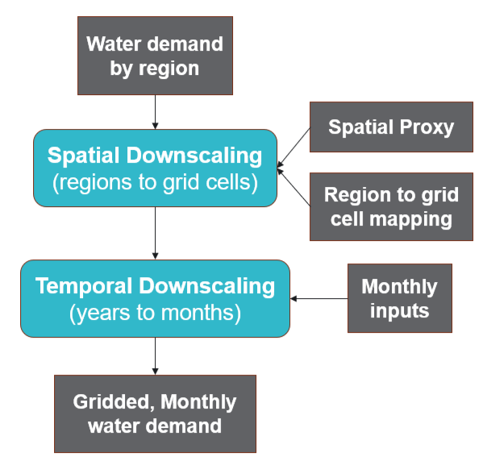

User Guide
==========
This page provides an in-depth guide to **tethys**, covering details of the downscaling methodology and advanced usage.

Version 2 is a major update with increased flexibilty for spatial resolutions and sectoral breakdowns.

.. note:: This page is currently under construction in preparation for version 2

Conceptual Overview
-------------------
**tethys** consists of 2 stages: spatial downscaling and (optionally) temporal downscaling.

Spatial Downscaling
^^^^^^^^^^^^^^^^^^^
For each water demand sector, **tethys** disaggregates water demand *by region* into water demand *by grid cell* based on an appropriate spatial proxy. GCAM uses 6 water demand sectors, and past downscaling workflows have used the following proxy configuration:

====================== ===============
Water Demand Sector    Spatial Proxy
====================== ===============
Domestic/Municipal     Population
Electricity Generation Population
Manufacturing          Population
Mining                 Population
Livestock              Livestock
Irrigation             Irrigated area
====================== ===============

Within a region, it is assumed that the distribution of water demand is proportional to the distribution of the proxy. For example, a grid cell that is part of the USA region and contains 1% of the USA's population would be allocated 1% of the USA's municipal water demand.

.. math::
	\text{demand}_\text{cell} = \text{demand}_\text{region} \times \frac{\text{proxy}_\text{cell}}{\text{proxy}_\text{region}}

A sector may consist of multiple subsectors. For example, in GCAM, the livestock sector is split into 5 categories of animal products. Additionally, available proxy datasets may not map directly to these subsectors. **tethys** accounts for this by allowing user-defined mappings of water demand subsectors to proxy variables. The table below shows an example mapping between GCAM livestock subsectors and animal categories in the `GLW 3 <https://doi.org/10.1038/sdata.2018.227>`_ dataset.

=================== ================
Livestock Subsector Spatial Proxy
=================== ================
Beef                Buffalo + Cattle
Dairy               Buffalo + Cattle
Pork                Pig
Poultry             Chicken + Duck
SheepGoat           Sheep + Goat
=================== ================

Subsectoral water demand estimates are sometimes only available at a coarser scale than estimates for the entire sector. This is the case for GCAM-USA, which only has water demand for each livestock subsector at the scale of the entire USA, while each state only has total demand for the entire livestock sector. **tethys** handles this by first downscaling each subsector using the specified proxy as usual, then harmonizing the result so that the total is consistent with the finer-scale constraint on the entire sector.

Since proxy datasets are not always available at the same spatial resolution as the desired output, **tethys** automatically re-grids proxies prior to downscaling. **tethys** also temporally interpolates proxies to the same years as the input demand data.

Temporal Downscaling
^^^^^^^^^^^^^^^^^^^^
**tethys** uses sector-specific formulas from the literature for temporal downscaling, which are described in detail below. In general, these determine the fraction of a year's water demand to allocate to each month based on a statistical relationship between monthly water demand and some other monthly variable. When necessary, outputs from spatial downscaling are interpolated to annual time steps as an intermediate step.

Domestic/Municipal
""""""""""""""""""
Temporal downscaling for the domestic/municipal sector follows the formula from Wada et al. (2011), which uses monthly temperature and a regional amplitude coefficient to reproduce summer peaks. For each grid cell,

.. math::
	\text{demand}_\text{month} = \frac{\text{demand}_\text{year}}{12} \times \left(\frac{\text{temp}_\text{month} - \text{temp}_\text{mean}}{\text{temp}_\text{max} - \text{temp}_\text{min}}R_\text{cell} + 1\right)

Electricity Generation
""""""""""""""""""""""
Temporal downscaling for the electricity generation sector follows the formula from Voisin et al. (2013), which assumes that monthly water demand is proportional to monthly electricity demand, which in turn depends on heating and cooling degree days (HDD and CDD).

When both annual heating and cooling are above certain thresholds, the water withdrawal for electricity generation in month i of year j is given by

.. math::
	W_{ij} = W_j\times\left[p_b\times\left(p_h\frac{\text{HDD}_{ij}}{\sum\text{HDD}_{ij}}+p_c\frac{\text{CDD}_{ij}}{\sum\text{CDD}_{ij}}+p_u\frac{1}{12}\right)+p_{it}\frac{1}{12}\right]
	
where W_j is the water withdrawal for electricity generation in year j, the p values are taken from :ref:`TD_Elec_paras`, and monthly and annual HDD/CDD values are calculated from :ref:`ClimateForcing/WATCH`. When sum(HDD) < 650 or sum(CDD) < 450, slightly different versions of this formula are used.

Irrigation
""""""""""
The monthly gridded irrigation water withdrawal was estimated by relying on monthly irrigation results from several global hydrological models (e.g. H08 [#Hanasaki2008a]_ [#Hanasaki2008b]_, LPJmL [#Rost2008]_, and PCR-GLOBWB [#Wada2011]_ [#VanBeek2011]_) to quantify monthly weighting profiles of how irrigation is spread out within a year in a particular region and per crop type.

Other
"""""
For the livestock, manufacturing, and mining sectors it was assumed that water withdrawal is uniform throughout the year. As months (and years) can have different numbers of days, this is also taken into consideration. For month i of year j, the monthly water withdrawal for any of these sectors is given by

.. math::

	W_i = W_j\times\frac{D_i}{D_j}

where W_j is the annual sectoral withdrawal, D_i is the number of days in month i, and D_j is the number of days in year j.

Configuration File
------------------
**tethys** uses a YAML configuration file.

References
----------
..
	NOTE: The below references were all copied from the previous version. In-line reference links have also been preserved in most sections that were largely copied from the previous verion. This should be reviewed.

.. [#Li2017] Li, X., Vernon, C.R., Hejazi, M.I., Link, R.P, Feng, L., Liu, Y., Rauchenstein, L.T., 2017. Xanthos – A Global Hydrologic Model. Journal of Open Research Software 5(1): 21. DOI: http://doi.org/10.5334/jors.181

.. [#Edmonds1985] Edmonds, J., and Reilly, J. M., 1985. Global Energy: Assessing the Future. Oxford University Press, New York, pp.317.

.. [#Edmonds1997] Edmonds, J., Wise, M., Pitcher, H., Richels, R., Wigley, T. and Maccracken, C., 1997. An integrated assessment of climate change and the accelerated introduction of advanced energy technologies-an application of MiniCAM 1.0. Mitigation and adaptation strategies for global change 1(4): 311-339. DOI: http://dx.doi.org/10.1023/B:MITI.0000027386.34214.60

.. [#Hejazi2014] Hejazi, M.I., Edmonds, J., Clarke, L., Kyle, P., Davies, E., Chaturvedi, V., Wise, M., Patel, P., Eom, J. and Calvin, K., 2014. Integrated assessment of global water scarcity over the 21st century under multiple climate change mitigation policies. Hydrology and Earth System Sciences 18: 2859-2883. DOI: http://dx.doi.org/10.5194/hess-18-2859-2014

.. [#Huang2017] Huang, Z., Hejazi, M., Li, X., Tang, Q., Leng, G., Liu, Y., Döll, P., Eisner, S., Gerten, D., Hanasaki, N., and Wada, Y., 2017. Reconstruction of global gridded monthly sectoral water withdrawals for 1971–2010 and analysis of their spatiotemporal patterns, Hydrology and Earth System Sciences Discussions, DOI: https://doi.org/10.5194/hess-2017-551

.. [#Wada2011] Wada, Y., Van Beek, L.P.H., Viviroli, D., Dürr, H.H., Weingartner, R. and Bierkens, M.F., 2011. Global monthly water stress: 2. Water withdrawal and severity of water stress. Water Resources Research 47(7): W07518. DOI: http://dx.doi.org/10.1029/2010WR009792

.. [#Siebert2007] Siebert, S., Döll, P., Feick, S., Hoogeveen, J. and Frenken, K., 2007. Global map of irrigation areas version 4.0. 1. Johann Wolfgang Goethe University, Frankfurt am Main, Germany/Food and Agriculture Organization of the United Nations, Rome, Italy.

.. [#Portmann2008] Portmann, F.T., Siebert, S., Bauer, C. and Döll, P., 2008. Global dataset of monthly growing areas of 26 irrigated crops: version 1.0. University of Frankfurt, Germany.

.. [#Klein2011] Klein Goldewijk, K., Beusen, A., Van Drecht, G. and De Vos, M., 2011. The HYDE 3.1 spatially explicit database of human induced global land use change over the past 12,000 years. Global Ecology and Biogeography 20(1): 73-86. DOI: https://doi.org/10.1111/j.1466-8238.2010.00587.x

.. [#CIESIN2016] Center for International Earth Science Information Network (CIESIN) - Columbia University. 2016. Gridded Population of the World, Version 4 (GPWv4): Population Count. NASA Socioeconomic Data and Applications Center (SEDAC), Palisades, NY. DOI: http://dx.doi.org/10.7927/H4X63JVC

.. [#Siebert2013] Siebert, S., Henrich, V., Frenken, K., and Burke, J., 2013. Global Map of Irrigation Areas version 5. Rheinische Friedrich-Wilhelms-University, Bonn, Germany / Food and Agriculture Organization of the United Nations, Rome, Italy.

.. [#Wint2007] Wint, W. and Robinson, T., 2007. Gridded livestock of the world. Food and Agriculture Organization (FAO), report 131, Rome.

.. [#Alcamo2002] Alcamo, J. and Henrichs, T., 2002. Critical regions: A model-based estimation of world water resources sensitive to global changes. Aquatic Sciences-Research Across Boundaries, 64(4): 352-362. DOI: https://doi.org/10.1007/PL00012591

.. [#Florke2004] Flörke, M. and Alcamo, J., 2004. European outlook on water use. Center for Environmental Systems Research, University of Kassel, Final Report, EEA/RNC/03/007, 83.

.. [#Hanasaki2008a] Hanasaki, N., Kanae, S., Oki, T., Masuda, K., Motoya, K., Shirakawa, N., Shen, Y. and Tanaka, K., 2008. An integrated model for the assessment of global water resources–Part 1: Model description and input meteorological forcing. Hydrology and Earth System Sciences 12(4): 1007-1025. DOI: https://doi.org/10.5194/hess-12-1007-2008

.. [#Hanasaki2008b] Hanasaki, N., Kanae, S., Oki, T., Masuda, K., Motoya, K., Shirakawa, N., Shen, Y. and Tanaka, K., 2008. An integrated model for the assessment of global water resources–Part 2: Applications and assessments. Hydrology and Earth System Sciences 12(4): 1027-1037. DOI: https://doi.org/10.5194/hess-12-1027-2008

.. [#Rost2008] Rost, S., Gerten, D., Bondeau, A., Lucht, W., Rohwer, J. and Schaphoff, S., 2008. Agricultural green and blue water consumption and its influence on the global water system. Water Resources Research 44(9): W09405. DOI: https://doi.org/10.1029/2007WR006331

.. [#VanBeek2011] Van Beek, L.P.H., Wada, Y. and Bierkens, M.F., 2011. Global monthly water stress: 1. Water balance and water availability. Water Resources Research 47(7): W07517. DOI: https://doi.org/10.1029/2010WR009791

.. [#Voisin2013] Voisin, N., Liu, L., Hejazi, M., Tesfa, T., Li, H., Huang, M., Liu, Y. and Leung, L.R., 2013. One-way coupling of an integrated assessment model and a water resources model: evaluation and implications of future changes over the US Midwest. Hydrology and Earth System Sciences 17(11): 4555-4575. DOI: https://doi.org/10.5194/hess-17-4555-2013

.. [#Hejazi2015] Hejazi, M.I., Voisin, N., Liu, L., Bramer, L.M., Fortin, D.C., Hathaway, J.E., Huang, M., Kyle, P., Leung, L.R., Li, H.Y. and Liu, Y., 2015. 21st century United States emissions mitigation could increase water stress more than the climate change it is mitigating. Proceedings of the National Academy of Sciences 112(34): 10635-10640. DOI: https://doi.org/10.1073/pnas.1421675112

.. [#Kim2016] Kim, S.H., Hejazi, M., Liu, L., Calvin, K., Clarke, L., Edmonds, J., Kyle, P., Patel, P., Wise, M. and Davies, E., 2016. Balancing global water availability and use at basin scale in an integrated assessment model. Climatic Change 136(2): 217-231. DOI: http://dx.doi.org/10.1007/s10584-016-1604-6

.. [#NetCDF] An Introduction to NetCDF. http://www.unidata.ucar.edu/software/netcdf/docs/netcdf_introduction.html