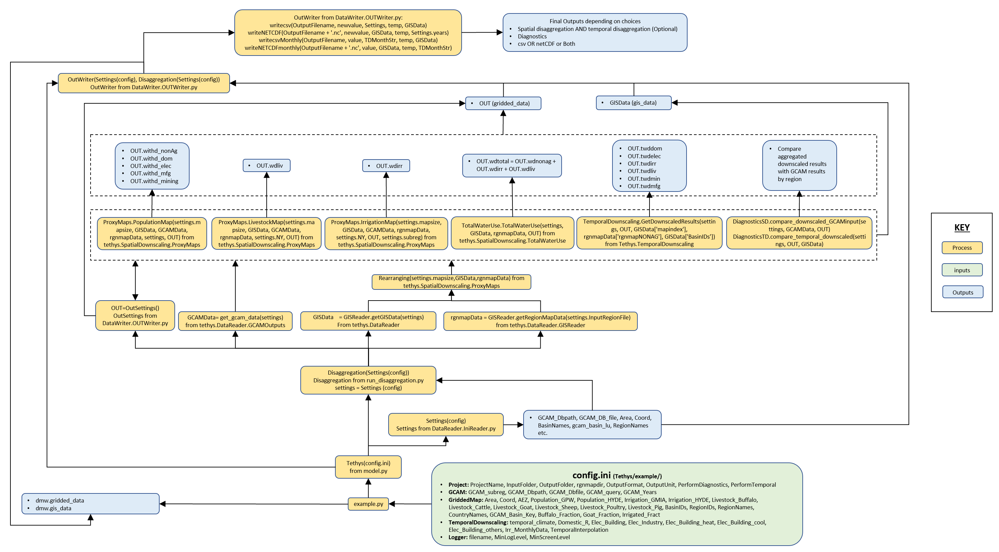
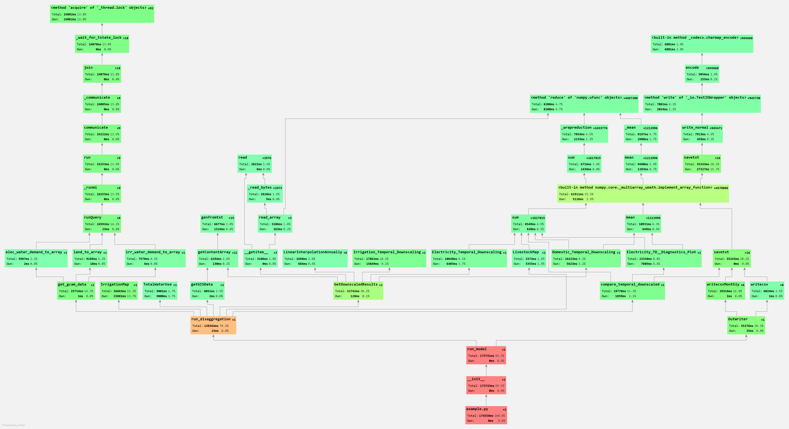

Model Structure
==================================

The following sub-pages document the main data flows and process in Tethys, key input files as well as a code profile of an example run.

Process Flows
----------------------------------

The following diagram shows additional details on key processes, inputs and outputs of the tethys model.

.. _structure_fig1:

  
  *Process flows in Tethys*
  
Key Inputs
-----------------------------------

.. centered::
   _`Table 1`: Key Inputs
   
.. csv-table::
   :file: tables/inputs.csv
   :widths: 20,20,20,20,20
   :header-rows: 1
   :align: center

   

Profile
----------------------------------

Profile for an example run.

.. _structure_fig2:

  
  *Code profile from PyCharm*
  