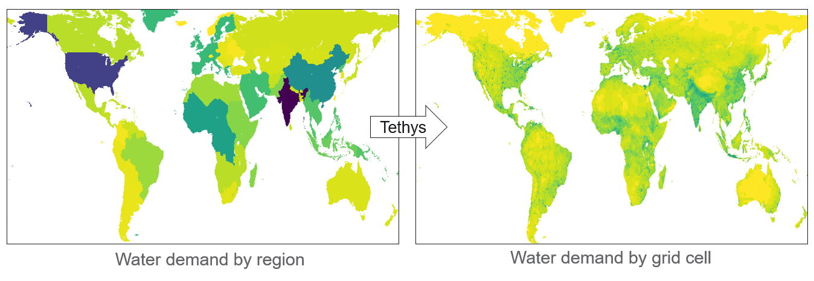

# Summary

Humans use water for many important tasks, such as drinking, growing food, and cooling power plants. Since future water demands depend on complex global interactions between economic sectors (e.g., demand for wheat in one country causing demand for water to grow that wheat in another country), it is often modeled at coarse spatial and temporal scales as part of models that account for complex, multi-sector system dynamics. However, models that project future water availability typically simulate physical processes at much finer scales. `Tethys` enables integration between these kinds of models by downscaling region-scale water demand projections using sector-specific proxies and formulas.

# Statement of Need

Global hydrological models often require gridded water demand data to represent the location and timing of flows for human consumption, but historical inventories of water use are often only available per country at annual or larger intervals [@hess-22-2117-2018]. In order to model future global economic linkages in detail, multi-sector models (e.g., the Global Change Analysis Model [@gmd-12-677-2019;@gmd-15-2533-2022]) also operate at these coarser spatial and temporal scales. This gap in scale makes downscaling water demands a common need.

The distribution of water demands depends on the location and timing of activities that use water, so the usual approach is to use relevant gridded datasets as spatial proxies for each water demand sector (e.g., assume that irrigation water demand is proportional to irrigated land area), then further allocate annual water demands among months according to formulas that capture seasonal variations [@hess-17-4555-2013]. This is typically accomplished with scripts designed for specific model-integration workflows, but different models and proxy datasets can have different breakdowns of water demand sectors, limiting reuse of such scripts.

Building on previous versions [@Li-2018], `Tethys` now generalizes this downscaling process to provide a convenient and flexible interface for configuring proxy rules, as well as specifying target output resolution, allowing researchers to easily generate finely gridded water demand data that are consistent with coarser scale inventories or simulations. `Tethys` has been used in scientific publications such as @Khan2023, which downscaled water demand from an ensemble of 75 socioeconomic and climate scenarios.

# Key Functionality

`Tethys` consists of 2 stages: spatial downscaling (\autoref{fig:1}) and (optionally) temporal downscaling. First, sectoral water demands by region are disaggregated to water demand by grid cell in proportion to appropriate spatial proxies, i.e.,

\begin{equation}
\text{demand}_\text{cell} = \text{demand}_\text{region} \times \frac{\text{proxy}_\text{cell}}{\text{proxy}_\text{region}}.
\end{equation}

Then, temporal downscaling follows sector-specific formulas from the literature, which determine the fraction of a year’s water demand to allocate to each month based on relationships between monthly water demand and other monthly variables. See the [documentation](https://jgcri.github.io/tethys) for more details and example usage.

# Acknowledgements

This research was supported by the U.S. Department of Energy, Office of Science, as part of research in MultiSector Dynamics, Earth and Environmental System Modeling Program. The Pacific Northwest National Laboratory is operated for DOE by Battelle Memorial Institute under contract DE-AC05-76RL01830. The views and opinions expressed in this paper are those of the authors alone.

# References
